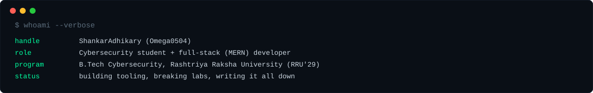
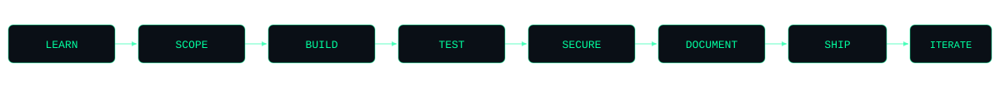
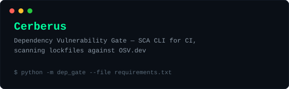
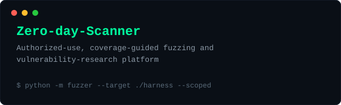
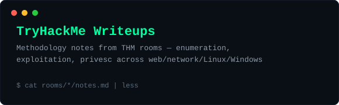
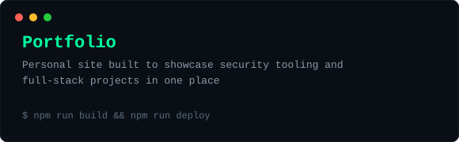
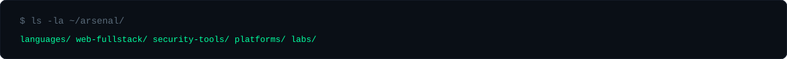
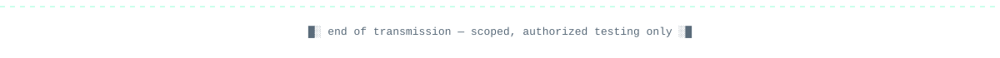

<div align="center">



<br>

<a href="https://www.linkedin.com/in/adhikaryxshankar/"></a>
<a href="https://tryhackme.com/p/Omega0504"></a>
<a href="https://github.com/ShankarAdhikary?tab=repositories"></a>

<br>


<a href="https://github.com/ShankarAdhikary?tab=followers"></a>


</div>


<h2><samp>&#9608;&#9617;&nbsp;&nbsp;01 &#8212; IDENTITY</samp></h2>



I'm a B.Tech Cybersecurity student at Rashtriya Raksha University, building tooling that sits between **security** and **software engineering** — CLI scanners that gate CI pipelines, fuzzing platforms for vulnerability research, and full-stack (MERN) apps for everything else.

- **Learn it** — cybersecurity fundamentals, CTF rooms, vulnerable-by-design labs, real writeups.
- **Build it** — CLI tools, fuzzers, full-stack apps, hackathon prototypes.
- **Break it** — enumeration, exploitation, and privilege escalation on TryHackMe rooms.
- **Document it** — every solved room and every shipped tool gets notes, not just a commit.

> Scoped, authorized testing only. All lab work is on sanctioned platforms.


<h2><samp>&#9608;&#9617;&nbsp;&nbsp;02 &#8212; HOW I WORK</samp></h2>



| Phase | What actually happens |
| :--- | :--- |
| **Learn** | New concept, new CTF room, or new part of the stack — read the docs before touching the keyboard. |
| **Scope** | Define what the tool or feature actually needs to do before writing the first line. |
| **Build** | CLI, API, or UI — whichever gets the idea into something runnable fastest. |
| **Test** | Run it against real inputs, break it on purpose, fix what falls over. |
| **Secure** | Check the same code for the vulnerability classes I study — injection, authz, misconfig. |
| **Document** | README, writeup, or inline notes — reproducible steps, not just "it works." |
| **Ship** | Push it, deploy it, or submit it — hackathon, coursework, or personal repo. |
| **Iterate** | Come back once it's used for real and fix what the first pass missed. |


<h2><samp>&#9608;&#9617;&nbsp;&nbsp;03 &#8212; FIELD PROJECTS</samp></h2>

<table>
<tr>
<td width="50%" valign="top">
<a href="https://github.com/ShankarAdhikary/Cerberus"></a>
</td>
<td width="50%" valign="top">
<a href="https://github.com/ShankarAdhikary/Zero-day-Scanner"></a>
</td>
</tr>
<tr>
<td width="50%" valign="top">
<a href="https://github.com/ShankarAdhikary/Try-Hack-Me-Writeup"></a>
</td>
<td width="50%" valign="top">
<a href="https://github.com/ShankarAdhikary/portfolio"></a>
</td>
</tr>
</table>

<details>
<summary><samp><b>&#9656;&nbsp; SUPPORTING REPOSITORIES</b></samp></summary>

<br>

| Repository | What it is | Domain |
| :--- | :--- | :--- |
| [**malscope**](https://github.com/ShankarAdhikary/malscope) | Python security tooling project. | Security |
| [**ARGUS**](https://github.com/ShankarAdhikary/ARGUS) | Security-focused project. | Security |
| [**krishi-setu**](https://github.com/ShankarAdhikary/krishi-setu) | Full-stack TypeScript application. | Full-Stack |
| [**Krishi**](https://github.com/ShankarAdhikary/Krishi) | Python application. | Full-Stack |
| [**SIH-2026**](https://github.com/ShankarAdhikary/SIH-2026) | Decentralized identity &amp; asset management platform using DIDs, NFT-based ownership, and smart-contract RBAC — built for Smart India Hackathon 2026 (BEL, PS #26125). | Hackathon |
| [**AcciGuard-AI**](https://github.com/ShankarAdhikary/AcciGuard-AI) | HTML/web project. | Full-Stack |

</details>


<h2><samp>&#9608;&#9617;&nbsp;&nbsp;04 &#8212; ARSENAL</samp></h2>



<table>
<tr><td align="right" width="170"><samp><b>LANGUAGES</b></samp></td><td>


</td></tr>

<tr><td align="right"><samp><b>WEB &amp; FULL-STACK</b></samp></td><td>


</td></tr>

<tr><td align="right"><samp><b>SECURITY TOOLS</b></samp></td><td>


</td></tr>

<tr><td align="right"><samp><b>PLATFORMS</b></samp></td><td>


</td></tr>

<tr><td align="right"><samp><b>LABS</b></samp></td><td>

</td></tr>
</table>


<h2><samp>&#9608;&#9617;&nbsp;&nbsp;05 &#8212; TELEMETRY</samp></h2>

<div align="center">


<br>


<br><br>

<picture>
  <source media="(prefers-color-scheme: dark)" srcset="https://raw.githubusercontent.com/ShankarAdhikary/ShankarAdhikary/output/github-snake-dark.svg" />
  <source media="(prefers-color-scheme: light)" srcset="https://raw.githubusercontent.com/ShankarAdhikary/ShankarAdhikary/output/github-snake.svg" />
  
</picture>

</div>


<h2><samp>&#9608;&#9617;&nbsp;&nbsp;06 &#8212; CURRENT OPS</samp></h2>

```console
$ tail -f ~/ops/NOW.log

[ACTIVE]  Cerberus         :: SCA CLI, OSV.dev lockfile gate for CI
[ACTIVE]  Zero-day-Scanner :: coverage-guided fuzzing, vulnerability research
[ACTIVE]  SIH-2026         :: DID-based identity platform for Smart India Hackathon
[ONGOING] TryHackMe        :: enumeration, exploitation, privesc writeups
[ONGOING] Coursework       :: B.Tech Cybersecurity, RRU'29
[QUEUED]  Portfolio        :: consolidate projects and writeups in one place
```

<table>
<tr>
<td width="50%" valign="top">

**Open to collaborate on**

- Security tooling and CI/CD vulnerability gates
- CTF practice and TryHackMe writeup collabs
- Full-stack (MERN) project builds
- Hackathon teams

</td>
<td width="50%" valign="top">

**How I work best**

- Document everything — a solved room or shipped tool isn't done until it's written up
- Small, focused tools over one big monolith
- Test against real inputs before calling anything finished
- Learn the concept before reaching for the tool

</td>
</tr>
</table>


<h2><samp>&#9608;&#9617;&nbsp;&nbsp;07 &#8212; CHANNELS</samp></h2>

<div align="center">

<a href="https://www.linkedin.com/in/adhikaryxshankar/"></a>
<a href="https://tryhackme.com/p/Omega0504"></a>
<a href="https://github.com/ShankarAdhikary"></a>

<br>



</div>
